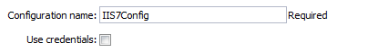
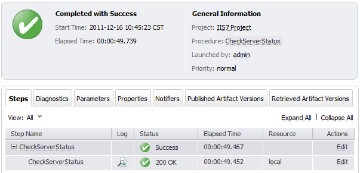
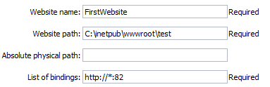
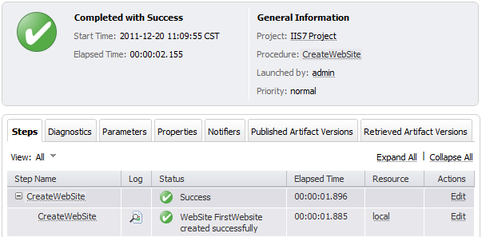
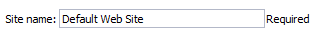
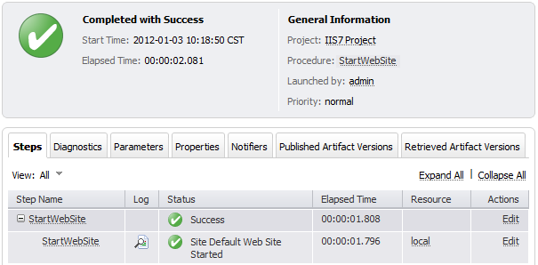

# EC IIS plugin

The IIS plugin allows users to interact with the Internet Information
Services Server 7 (IIS7) and higher versions and accomplish tasks such
as managing website and virtual directories using the specific tools of
IIS7 through the command line. Using this plugin, users can configure
IIS from scripts or executables, run tasks as create a virtual directory
and create a website. Also, users can check the status of running
processes to see if they ran successfully or if an error existed, and
determine what caused the error.

The IIS plugin uses `appcmd.exe` to interact with IIS, so the procedures
run on the resource with the IIS server.

The **Deploy** and **AdvancedDeploy** procedures use the WebDeploy
utility. WebDeploy must be installed separately; it is not included in
the default IIS setup. It can be downloaded from the [Microsoft
site](https://www.iis.net/downloads/microsoft/web-deploy). After
installation, WebDeploy can typically be found in
`C:\Program Files\IIS\Microsoft Web Deploy V3` directory.

## Prerequisites

This plugin uses an updated version of Perl, cb-perl shell (Perl v5.32),
and requires CloudBees CD/RO agents version 10.3 or later to work.

## Integrated version

The IIS plugin supports the following versions of IIS:

-   7.0

-   7.5

-   8.0

-   8.5

-   10

The IIS plugin supports the following versions of Web Deploy:

-   3.5

-   3.6

## Compile

Run gradlew to compile the plugin

`./gradlew`

## Create IIS plugin configurations

Plugin configurations are sets of parameters that can be applied across
some, or all, plugin procedures. They can reduce the repetition of
common values, create predefined parameter sets, and securely store
credentials. Each configuration is given a unique name that is entered
in the designated parameter for the plugin procedures that use them. The
following steps illustrate how to create a plugin configuration that can
be used by one or more plugin procedures.

To create a plugin configuration:

1.  Navigate to **DevOps Essentials &gt; Plugin Management &gt; Plugin
    configurations**.

2.  Select **Add plugin configuration** to create a new configuration.

3.  In the **New Configuration** window, specify a **Name** for the
    configuration.

4.  Select the **Project** that the configuration belongs to.

5.  Optionally, add a **Description** for the configuration.

6.  Select the appropriate **Plugin** for the configuration.

7.  Configure the plugin configuration parameters.

    For more information, refer to [CloudBees CD/RO
    plugins](https://docs.cloudbees.com/docs/cloudbees-cd-plugin-docs/latest/).

8.  Select **OK**.

Depending on your plugin configuration and how you run procedures, the
**Input parameters &gt; Configuration name** field may behave
differently in the CloudBees CD/RO UI. For more information, refer to
[Differences in plugin UI
behavior](https://docs.cloudbees.com/docs/cloudbees-cd-plugin-docs/latest/#plugin-ui-differences).

### IIS plugin configuration parameters

The configuration is only used with the [CheckServerStatus](#checkserverstatus) procedure.

<table>
<colgroup>
<col style="width: 50%" />
<col style="width: 50%" />
</colgroup>
<thead>
<tr class="header">
<th style="text-align: left;">Parameter</th>
<th style="text-align: left;">Description</th>
</tr>
</thead>
<tbody>
<tr class="odd">
<td style="text-align: left;">
Configuration Name
</td>
<td style="text-align: left;">
Required. The unique name for the
configuration.
</td>
</tr>
<tr class="even">
<td style="text-align: left;">
IIS IP Address
</td>
<td style="text-align: left;">
URL for the IIS server. It must include
the protocol (for example, <code>\http://192.168.1.100</code>).
</td>
</tr>
<tr class="odd">
<td style="text-align: left;">
IIS Port
</td>
<td style="text-align: left;">
Port for the IIS server. This port is
used in conjunction with the IP address to conform the URL (for example,
<code>8081</code>). If not provided, CloudBees CD/RO uses the default
port <code>80</code>.
</td>
</tr>
<tr class="even">
<td style="text-align: left;">
Computer Name (DEPRECATED)
</td>
<td style="text-align: left;">
Computer name or IP address without
backslashes (for example, <code>server01</code>).

This parameter has been deprecated and will be removed in the
future.

</td>
</tr>
<tr class="odd">
<td style="text-align: left;">
Login as
</td>
<td style="text-align: left;"><ul>
<li>
<strong>Username:</strong> Username that CloudBees CD/RO uses to
communicate with the IIS server.
</li>
<li>
<strong>Password:</strong> Password for the specified
username.
</li>
<li>
<strong>Retype Password:</strong> Retype the password.
</li>
</ul></td>
</tr>
</tbody>
</table>

## Create IIS plugin procedures

Plugin procedures can be used in [procedure
steps](https://docs.cloudbees.com/docs/cloudbees-cd/latest/procedures/),
[process
steps](https://docs.cloudbees.com/docs/cloudbees-cd/latest/applications-processes/plugin-process-steps),
and [pipeline
tasks](https://docs.cloudbees.com/docs/cloudbees-cd/latest/pipelines/example-plugin-task),
allowing you to orchestrate third-party tools at the appropriate time in
your component, application process, or pipeline.

Depending on your plugin configuration and how you run procedures, the
**Input parameters &gt; Configuration name** field may behave
differently in the CloudBees CD/RO UI. For more information, refer to
[Differences in plugin UI
behavior](https://docs.cloudbees.com/docs/cloudbees-cd-plugin-docs/latest/#plugin-ui-differences).

### CheckServerStatus

Checks the status of the specified server.

<table>
<colgroup>
<col style="width: 50%" />
<col style="width: 50%" />
</colgroup>
<thead>
<tr class="header">
<th style="text-align: left;">Parameter</th>
<th style="text-align: left;">Description</th>
</tr>
</thead>
<tbody>
<tr class="odd">
<td style="text-align: left;">
Configuration name
</td>
<td style="text-align: left;">
Provide the name of the configuration
that holds connection information for the IIS server. Credentials are
only used from the plugin configuration if the <strong>Use
Credentials</strong> parameter is selected.
</td>
</tr>
<tr class="even">
<td style="text-align: left;">
Use Credentials (Deprecated)
</td>
<td style="text-align: left;">
Indicate if credentials must be used.
If selected, CloudBees CD/RO uses the username and password from the
plugin configuration.

This parameter has been deprecated and will be removed in the future.
Credentials are used if they are provided.

</td>
</tr>
<tr class="odd">
<td style="text-align: left;">
Credential
</td>
<td style="text-align: left;">
Username and password for basic
authentication.
</td>
</tr>
<tr class="even">
<td style="text-align: left;">
Link to Check For
</td>
<td style="text-align: left;">
URL to check. If not specified, a URL
is constructed from the IIS configuration.
</td>
</tr>
<tr class="odd">
<td style="text-align: left;">
Expected Status
</td>
<td style="text-align: left;">
3-digit HTTP status to wait for.
Default is <code>200</code>. This can also be a regular expression (for
example, <code>200|201</code>).
</td>
</tr>
<tr class="even">
<td style="text-align: left;">
Check Unavailable
</td>
<td style="text-align: left;">
If selected, the
<code>server:port</code> is checked for availability and the URL path
and status parameters are ignored. If the server is available, the
procedure fails.
</td>
</tr>
<tr class="odd">
<td style="text-align: left;">
Timeout
</td>
<td style="text-align: left;">
Connection timeout. Default is
<code>30</code> seconds.
</td>
</tr>
<tr class="even">
<td style="text-align: left;">
Retries
</td>
<td style="text-align: left;">
Number of retries. This only affects
connecting to server, and not the status returned by the server. Default
is <code>1</code>.
</td>
</tr>
</tbody>
</table>

### CreateAppPool

Creates an IIS application pool or updates the existed one.

<table>
<colgroup>
<col style="width: 50%" />
<col style="width: 50%" />
</colgroup>
<thead>
<tr class="header">
<th style="text-align: left;">Parameter</th>
<th style="text-align: left;">Description</th>
</tr>
</thead>
<tbody>
<tr class="odd">
<td style="text-align: left;">
Application pool name
</td>
<td style="text-align: left;">
Name of the application pool to create
(for example, <code>FirstAppPool</code>).
</td>
</tr>
<tr class="even">
<td style="text-align: left;"></td>
<td style="text-align: left;">
Configures the application pool to load
a specific version of the .NET Framework.

If <strong>No Managed Code</strong> is selected, all ASP.NET requests
will fail.

</td>
</tr>
<tr class="odd">
<td style="text-align: left;">
Enable 32-bit applications
</td>
<td style="text-align: left;">
If selected for an application pool on
a 64-bit operating system, the worker processes serving the application
pool run in WOW64 (Windows on Windows64) mode. In WOW64 mode, 32-bit
processes load only 32-bit applications.
</td>
</tr>
<tr class="even">
<td style="text-align: left;">
Managed pipeline mode
</td>
<td style="text-align: left;">
Configures ASP.NET to run in classic
mode as an ISAPI extension or in integrated mode where managed code is
integrated into the request-processing pipeline.
</td>
</tr>
<tr class="odd">
<td style="text-align: left;">
Queue length
</td>
<td style="text-align: left;">
Maximum number of requests that
HTTP.sys queues for the application pool. When the queue is full, new
requests receive a 503 "Service Unavailable" response.
</td>
</tr>
<tr class="even">
<td style="text-align: left;">
Start automatically
</td>
<td style="text-align: left;">
If selected, the application pool
starts on creation or when IIS starts. Starting an application pool sets
this property to <code>True</code>. Stopping an application sets this
property to <code>False</code>.
</td>
</tr>
<tr class="odd">
<td style="text-align: left;">
Limit
</td>
<td style="text-align: left;">
Configures the maximum percentage of
CPU time (in 1/1000ths of a percent) that the worker processes in an
application pool are allowed to consume over a period of time, as
indicated by the <strong>Limit Interval</strong> parameter
(<code>resetInterval</code> property). If the limit set by this
parameter is exceeded, the event is written to the event log and an
optional set of events can be triggered or determined by the
<strong>Limit action</strong> parameter (action property). Setting the
value to <code>0</code> disables the limiting of worker processes to a
percentage of CPU time.
</td>
</tr>
<tr class="even">
<td style="text-align: left;">
Limit action
</td>
<td style="text-align: left;">
Specifies the action to take when the
specified <strong>Limit</strong> is exceeded.

<ul>
<li>
<strong>NoAction:</strong> An event log entry is
generated.
</li>
<li>
<strong>KillW3WP:</strong> An event log entry is generated and
the application pool is shut down for the duration of the reset
interval.
</li>
</ul></td>
</tr>
<tr class="odd">
<td style="text-align: left;">
Limit interval (minutes)
</td>
<td style="text-align: left;">
Specifies the reset period, in minutes,
for CPU monitoring and throttling limits on the application pool. When
the number of minutes elapsed since the last process accounting reset
equals the <strong>Limit interval</strong>, IIS resets the CPU timers
for both the logging and limit intervals. Setting the value of
<strong>Limit interval</strong> to <code>0</code> disables CPU
monitoring.
</td>
</tr>
<tr class="even">
<td style="text-align: left;">
Processor affinity enabled
</td>
<td style="text-align: left;">
If selected, the worker processes
serving this application pool are forced to run on specific CPUs. This
enables sufficient use of CPU caches on multiprocessor servers.
</td>
</tr>
<tr class="odd">
<td style="text-align: left;">
Processor affinity mask
</td>
<td style="text-align: left;">
Hexadecimal mask that forces the worker
processes for this application pool to run on a specific CPU. If
selected, a value of <code>0</code> results in an error
condition.
</td>
</tr>
<tr class="even">
<td style="text-align: left;">
Identity
</td>
<td style="text-align: left;">
Configures the application pool to run
as a built-in account, such as <strong>Network Service</strong>
(recommended), <strong>Local Service</strong>, or as a specific user
identity.
</td>
</tr>
<tr class="odd">
<td style="text-align: left;">
Idle timeout (minutes)
</td>
<td style="text-align: left;">
Amount of time, in minutes, a worker
process remains idle before it shuts down. A worker process is idle if
it is not processing requests and no new requests are received.
</td>
</tr>
<tr class="even">
<td style="text-align: left;">
Load user profile
</td>
<td style="text-align: left;">
If selected, IIS loads the user profile
for the application pool identity. If not selected, IIS 6.0 behavior is
used.
</td>
</tr>
<tr class="odd">
<td style="text-align: left;">
Maximum worker processes
</td>
<td style="text-align: left;">
Maximum number of worker processes
permitted to service requests for the application pool. If this number
is greater than <code>1</code>, the application pool is referred to as a
"Web Garden".
</td>
</tr>
<tr class="even">
<td style="text-align: left;">
Ping enabled
</td>
<td style="text-align: left;">
If selected, the worker processes
serving this application pool are pinged periodically to ensure that
they are still responsive. This process is called health
monitoring.
</td>
</tr>
<tr class="odd">
<td style="text-align: left;">
Ping maximum response time
(seconds)
</td>
<td style="text-align: left;">
Maximum time, in seconds, that a worker
process is given to respond to a health monitoring ping. If the worker
process does not respond, it is terminated.
</td>
</tr>
<tr class="even">
<td style="text-align: left;">
Ping period (seconds)
</td>
<td style="text-align: left;">
Period of time, in seconds, between
health monitoring pings sent to the worker processes serving this
application pool.
</td>
</tr>
<tr class="odd">
<td style="text-align: left;">
Shutdown time limit (seconds)
</td>
<td style="text-align: left;">
Period of time, in seconds, a worker
process is given to finish processing requests and shut down. If the
worker process exceeds the shutdown time limit, it is
terminated.
</td>
</tr>
<tr class="even">
<td style="text-align: left;">
Startup time limit (seconds)
</td>
<td style="text-align: left;">
Period of time, in seconds, a worker
process is given to start up and initialize. If the worker process
initialization exceeds the startup time limit, it is
terminated.
</td>
</tr>
<tr class="odd">
<td style="text-align: left;">
Application pool process orphaning
enabled
</td>
<td style="text-align: left;">
If selected, an unresponsive worker
process is abandoned (orphaned) instead of terminated. This feature can
be used to debug a worker process failure.
</td>
</tr>
<tr class="even">
<td style="text-align: left;">
Orphan action executable
</td>
<td style="text-align: left;">
Executable to run when a worker process
is abandoned (orphaned). For example, <code>C:\dbgtools\ntsd.exe</code>
invokes NTSD to debug a worker process failure.
</td>
</tr>
<tr class="odd">
<td style="text-align: left;">
Orphan action executable
parameters
</td>
<td style="text-align: left;">
Parameters for the executable that are
run when a worker process is abandoned (orphaned). For example,
<code>-g -p %1%</code> is appropriate if the NTSD is the executable
invoked for debugging worker process failures.
</td>
</tr>
<tr class="even">
<td style="text-align: left;">
Service unavailable response
type
</td>
<td style="text-align: left;"><ul>
<li>
<strong>HttpLevel:</strong> If the application pool is stopped,
HTTP.sys returns an HTTP 503 error.
</li>
<li>
<strong>TcpLevel:</strong> If the application pool is stopped,
HTTP.sys resets the connection. This is useful if the load balancer
recognizes one of the response types and subsequently redirects
it.
</li>
</ul></td>
</tr>
<tr class="odd">
<td style="text-align: left;">
Rapid fail protection enabled
</td>
<td style="text-align: left;">
If selected, the application pool is
shut down if there are a specified number of worker process failures
(Maximum failures) within a specified period (Failure interval). By
default, an application pool is shut down if there are five failures in
a five-minute period.
</td>
</tr>
<tr class="even">
<td style="text-align: left;">
Failure interval (minutes)
</td>
<td style="text-align: left;">
The time interval, in minutes, during
which the specified number of worker process failures (Maximum failures)
must occur before the application pool is shut down by Rapid Fail
Protection.
</td>
</tr>
<tr class="odd">
<td style="text-align: left;">
Maximum failures
</td>
<td style="text-align: left;">
Maximum number of worker process
failures permitted before the application pool is shut down by Rapid
Fail Protection.
</td>
</tr>
<tr class="even">
<td style="text-align: left;">
Shutdown executable
</td>
<td style="text-align: left;">
Executable to run when an application
pool is shut down by Rapid Fail Protection. This can be used to
configure a load balancer to redirect traffic for this application to
another server.
</td>
</tr>
<tr class="odd">
<td style="text-align: left;">
Shutdown executable parameters
</td>
<td style="text-align: left;">
Parameters for the executable to run
when an application pool is shut down by Rapid Fail Protection.
</td>
</tr>
<tr class="even">
<td style="text-align: left;">
Disable overlapped recycle
</td>
<td style="text-align: left;">
If selected, when the application pool
recycles, the existing worker process exits before another worker
process is created.

Select this option if the worker process loads an application that
does not support multiple instances.

</td>
</tr>
<tr class="odd">
<td style="text-align: left;">
Disable recycling for configuration
changes
</td>
<td style="text-align: left;">
If selected, the application pool does
not recycle when its configuration is changed.
</td>
</tr>
<tr class="even">
<td style="text-align: left;">
Private memory limit (KB)
</td>
<td style="text-align: left;">
Maximum amount of private memory, in
KB, that a worker process can consume before the application pool is
recycled. A value of <code>0</code> means there is no limit.
</td>
</tr>
<tr class="odd">
<td style="text-align: left;">
Regular time interval
(minutes)
</td>
<td style="text-align: left;">
Period of time, in minutes, after which
an application pool recycles. A value of <code>0</code> means the
application pool does not recycle at a regular interval.
</td>
</tr>
<tr class="even">
<td style="text-align: left;">
Request limit
</td>
<td style="text-align: left;">
Maximum number of requests an
application pool can process before it is recycled. A value of
<code>0</code> means the application pool can process an unlimited
number of requests.
</td>
</tr>
<tr class="odd">
<td style="text-align: left;">
Specific times
</td>
<td style="text-align: left;">
A set of specific local times, in
24-hour format, when the application pool is recycled.
</td>
</tr>
<tr class="even">
<td style="text-align: left;">
Virtual memory limit (KB)
</td>
<td style="text-align: left;">
Maximum amount of virtual memory, in
KB, that a worker process can consume before the application pool is
recycled. A value of <code>0</code> means there is no limit.
</td>
</tr>
<tr class="odd">
<td style="text-align: left;">
Additional parameters
</td>
<td style="text-align: left;">
Additional parameters to pass to
appcmd.exe.
</td>
</tr>
</tbody>
</table>

### CreateVirtualDirectory

Creates a new virtual directory in the specified website or updates the
existing virtual directory.

<table>
<colgroup>
<col style="width: 50%" />
<col style="width: 50%" />
</colgroup>
<thead>
<tr class="header">
<th style="text-align: left;">Parameter</th>
<th style="text-align: left;">Description</th>
</tr>
</thead>
<tbody>
<tr class="odd">
<td style="text-align: left;">
Application name
</td>
<td style="text-align: left;">
The website and virtual path to contain
the virtual directory to create (for example,
<code>Default Web Site/myapp02</code>).
</td>
</tr>
<tr class="even">
<td style="text-align: left;">
Virtual path
</td>
<td style="text-align: left;">
Virtual path of the virtual directory
(for example, <code>/myvirtualdir</code>).
</td>
</tr>
<tr class="odd">
<td style="text-align: left;">
Absolute physical path
</td>
<td style="text-align: left;">
The absolute physical path of the
Virtual Directory to create (for example,
<code>c:/Inetpub/wwwroot/myvdir</code>).
</td>
</tr>
<tr class="even">
<td style="text-align: left;">
Create Directory?
</td>
<td style="text-align: left;">
If selected, the specified directory is
created if it does not exist.
</td>
</tr>
<tr class="odd">
<td style="text-align: left;">
Credential
</td>
<td style="text-align: left;">
Credentials used to access the site
folder. It can be used for network paths.

Passwords are stored in clear text in the IIS configuration. If this
field is not set, application user (pass-through authentication) is
issued. Double quotation marks <code>"</code> are not supported in the
username and password due to escape issues.

</td>
</tr>
</tbody>
</table>

### CreateWebApplication

Creates or updates and starts an in-process web application in the given
directory. This procedure assumes that the specified application path
exists as a virtual directory.

<table>
<colgroup>
<col style="width: 50%" />
<col style="width: 50%" />
</colgroup>
<thead>
<tr class="header">
<th style="text-align: left;">Parameter</th>
<th style="text-align: left;">Description</th>
</tr>
</thead>
<tbody>
<tr class="odd">
<td style="text-align: left;">
Website Name
</td>
<td style="text-align: left;">
The name of the website to add the
application to (for example, <code>Default Web Site</code>).
</td>
</tr>
<tr class="even">
<td style="text-align: left;">
Virtual Path
</td>
<td style="text-align: left;">
Virtual path of the application (for
example, <code>/myApplication</code>).
</td>
</tr>
<tr class="odd">
<td style="text-align: left;">
Absolute Physical Path
</td>
<td style="text-align: left;">
The absolute physical path of the
application to create (for
example,<code>c:/Inetpub/wwwroot/myApp</code>).
</td>
</tr>
<tr class="even">
<td style="text-align: left;">
Create Directory?
</td>
<td style="text-align: left;">
If selected, the specified directory is
created if it does not already exist.
</td>
</tr>
<tr class="odd">
<td style="text-align: left;">
Credential
</td>
<td style="text-align: left;">
Credentials used to access the site
folder. It can be used for network paths.

Passwords are stored in clear text in the IIS configuration. If this
field is not set, application user (pass-through authentication) is
issued. Double quotation marks <code>"</code> are not supported in the
username and password due to escape issues

</td>
</tr>
</tbody>
</table>

### CreateWebSite

Creates or updates a website configuration on a local or remote
computer.

<table>
<colgroup>
<col style="width: 50%" />
<col style="width: 50%" />
</colgroup>
<thead>
<tr class="header">
<th style="text-align: left;">Parameter</th>
<th style="text-align: left;">Description</th>
</tr>
</thead>
<tbody>
<tr class="odd">
<td style="text-align: left;">
Website name
</td>
<td style="text-align: left;">
The name of the website to
create.
</td>
</tr>
<tr class="even">
<td style="text-align: left;">
Website path
</td>
<td style="text-align: left;">
If specified, the root application
containing a root virtual directory pointing to the specified path is
created for this site. If omitted, the site is created without a root
application and cannot be started until one is created.
</td>
</tr>
<tr class="odd">
<td style="text-align: left;">
Website ID
</td>
<td style="text-align: left;">
ID of the website.
</td>
</tr>
<tr class="even">
<td style="text-align: left;">
List of bindings
</td>
<td style="text-align: left;">
Comma-separated list of bindings that
use the friendly form of <code>\http://domain:port,...</code> or raw
form of <code>protocol/bindingInformation,...</code>.
</td>
</tr>
<tr class="odd">
<td style="text-align: left;">
Create Directory?
</td>
<td style="text-align: left;">
If selected, the specified directory is
created if it does not already exist.
</td>
</tr>
<tr class="even">
<td style="text-align: left;">
Credential
</td>
<td style="text-align: left;">
Credentials used to access the site
folder. It can be used for network paths.

Passwords are stored in clear text in the IIS configuration. If this
field is not set, application user (pass-through authentication) is
issued. Double quotation marks <code>"</code> are not supported in the
username and password due to escape issues.

</td>
</tr>
</tbody>
</table>

### DeleteWebApplication

Deletes a web application from the specified website.

<table>
<colgroup>
<col style="width: 50%" />
<col style="width: 50%" />
</colgroup>
<thead>
<tr class="header">
<th style="text-align: left;">Parameter</th>
<th style="text-align: left;">Description</th>
</tr>
</thead>
<tbody>
<tr class="odd">
<td style="text-align: left;">
Application Name
</td>
<td style="text-align: left;">
The website that contains the
application to delete (for example, <code>Default Web Site/</code> or
<code>Site1/myapp</code>).
</td>
</tr>
<tr class="even">
<td style="text-align: left;">
Strict Mode
</td>
<td style="text-align: left;">
If selected, the procedure fails if the
specified application does not exist.
</td>
</tr>
</tbody>
</table>

### DeleteVirtualDirectory

Deletes a virtual directory from the specified website.

<table>
<colgroup>
<col style="width: 50%" />
<col style="width: 50%" />
</colgroup>
<thead>
<tr class="header">
<th style="text-align: left;">Parameter</th>
<th style="text-align: left;">Description</th>
</tr>
</thead>
<tbody>
<tr class="odd">
<td style="text-align: left;">
Virtual directory name
</td>
<td style="text-align: left;">
The website and virtual path that
contain the virtual directory to delete (for example,
<code>Default Web Site/</code> or <code>Site1/myapp</code>).
</td>
</tr>
<tr class="even">
<td style="text-align: left;">
Strict mode
</td>
<td style="text-align: left;">
If selected, the procedure fails if the
specified virtual directory does not exist.
</td>
</tr>
</tbody>
</table>

### DeleteWebSite

Deletes a website.

<table>
<colgroup>
<col style="width: 50%" />
<col style="width: 50%" />
</colgroup>
<thead>
<tr class="header">
<th style="text-align: left;">Parameter</th>
<th style="text-align: left;">Description</th>
</tr>
</thead>
<tbody>
<tr class="odd">
<td style="text-align: left;">
Website name
</td>
<td style="text-align: left;">
The name of the website to delete (for
example, <code>Default Web Site/</code> or
<code>Site1/myapp</code>).
</td>
</tr>
<tr class="even">
<td style="text-align: left;">
Strict mode
</td>
<td style="text-align: left;">
If selected, the procedure fails if the
specified application does not exist.
</td>
</tr>
</tbody>
</table>

### DeleteAppPool

Deletes an application pool.

<table>
<colgroup>
<col style="width: 50%" />
<col style="width: 50%" />
</colgroup>
<thead>
<tr class="header">
<th style="text-align: left;">Parameter</th>
<th style="text-align: left;">Description</th>
</tr>
</thead>
<tbody>
<tr class="odd">
<td style="text-align: left;">
Application pool name
</td>
<td style="text-align: left;">
The name of the website to delete (for
example, <code>Default Web Site/</code> or
<code>Site1/myapp</code>).
</td>
</tr>
<tr class="even">
<td style="text-align: left;">
Strict mode
</td>
<td style="text-align: left;">
If selected, the procedure fails if the
specified application pool does not exist.
</td>
</tr>
</tbody>
</table>

### DeployCopy

Copies the application files recursively to the website application\`s
physical directory.

<table>
<colgroup>
<col style="width: 50%" />
<col style="width: 50%" />
</colgroup>
<thead>
<tr class="header">
<th style="text-align: left;">Parameter</th>
<th style="text-align: left;">Description</th>
</tr>
</thead>
<tbody>
<tr class="odd">
<td style="text-align: left;">
Destination path
</td>
<td style="text-align: left;">
Required. Path to the destination
directory. This must be a physical directory, but it may have an IIS
virtual directory pointing to it (for example,
<code>C:\inetpub\wwwroot\copyTest</code>).
</td>
</tr>
<tr class="even">
<td style="text-align: left;">
Path to XCOPY
</td>
<td style="text-align: left;">
Required. Provide the relative or
absolute path to the XCOPY executable.
</td>
</tr>
<tr class="odd">
<td style="text-align: left;">
Source path
</td>
<td style="text-align: left;">
Required. Provide the path to the
source directory (for example,
<code>C:\inetpub\wwwroot\test</code>).
</td>
</tr>
<tr class="even">
<td style="text-align: left;">
Additional options
</td>
<td style="text-align: left;">
Option switches for the XCOPY
executable, excluding source and destination directories. The default
options are those recommended by Microsoft for ASP.NET and IIS website
deployment; exercise caution when changing these options.

<ul>
<li>
<code>/E</code> - Deep copy including empty dirs
</li>
<li>
<code>/K</code> - Copy attributes
</li>
<li>
<code>/R</code> - Overwrite read-only files
</li>
<li>
<code>/H</code> - Copy hidden and system files
</li>
<li>
<code>/I</code> - If the destination does not exist, and you are
copying more than one file, it is assumed that the destination is a
directory.
</li>
<li>
<code>/Y</code> - Suppress prompting for overwrite
confirmation
</li>
</ul></td>
</tr>
</tbody>
</table>

### Deploy

Uses MSDeploy (WebDeploy) to deploy a package or a site from a directory
into the specified destination and allows you to configure the
application pool.

MSDeploy is required for this procedure.

<table>
<colgroup>
<col style="width: 50%" />
<col style="width: 50%" />
</colgroup>
<thead>
<tr class="header">
<th style="text-align: left;">Parameter</th>
<th style="text-align: left;">Description</th>
</tr>
</thead>
<tbody>
<tr class="odd">
<td style="text-align: left;">
MS deploy path
</td>
<td style="text-align: left;">
Provide the relative or absolute path
to the MSDeploy executable.
</td>
</tr>
<tr class="even">
<td style="text-align: left;">
Deploy source path
</td>
<td style="text-align: left;">
A path to package (for example,
<code>application.zip</code>) or to a directory that contains the
content to be deployed.
</td>
</tr>
<tr class="odd">
<td style="text-align: left;">
Destination website
</td>
<td style="text-align: left;">
Name of the website to be
deployed.
</td>
</tr>
<tr class="even">
<td style="text-align: left;">
Destination application
</td>
<td style="text-align: left;">
Name of the application to be deployed.
If not provided, the content is placed under the website.
</td>
</tr>
<tr class="odd">
<td style="text-align: left;">
Application pool name
</td>
<td style="text-align: left;">
Application pool name. If the
application pool does not exist, it is created. If not specified, the
application is placed into the default pool, which has the same name as
the website.
</td>
</tr>
<tr class="even">
<td style="text-align: left;"><pre><code>+.NET+ framework version</code></pre></td>
<td style="text-align: left;"><pre><code>The Microsoft(R) .NET Framework version 3.5 includes all the functionality of earlier versions, introduces new features for the technologies in versions 2.0 and 3.0, and provides additional functionality in the form of new assemblies. To use version 3.5, install the appropriate version of .NET Framework and use the product-specific guidelines.</code></pre></td>
</tr>
<tr class="odd">
<td style="text-align: left;">
Enable 32-bit applications
</td>
<td style="text-align: left;">
If selected for an application pool on
a 64-bit operating system, the worker processes serving the application
pool run in WOW64 (Windows on Windows64) mode. In WOW64 mode, 32-bit
processes load only 32-bit applications.
</td>
</tr>
<tr class="even">
<td style="text-align: left;">
Managed pipeline mode
</td>
<td style="text-align: left;">
Configures ASP.NET to run in classic
mode as an ISAPI extension or in integrated mode where managed code is
integrated into the request-processing pipeline.
</td>
</tr>
<tr class="odd">
<td style="text-align: left;">
Queue length
</td>
<td style="text-align: left;">
Maximum number of requests that
HTTP.sys queues for the application pool. When the queue is full, new
requests receive a 503 "Service Unavailable" response.
</td>
</tr>
<tr class="even">
<td style="text-align: left;">
Start automatically
</td>
<td style="text-align: left;">
If selected, the application pool
starts on creation or when IIS starts. Starting an application pool sets
this property to <code>True</code>. Stopping an application sets this
property to <code>False</code>.
</td>
</tr>
<tr class="odd">
<td style="text-align: left;">
Additional settings for application
pool
</td>
<td style="text-align: left;">
Additional parameters to pass to
<code>appcmd.exe</code> for application pool configuration.
</td>
</tr>
<tr class="even">
<td style="text-align: left;">
Additional Parameters
</td>
<td style="text-align: left;">
Additional parameters (for example,
<code>-enableRule:AppOffline</code>) to pass to Web Deploy. For the list
of available settings, refer to <a
href="https://learn.microsoft.com/en-us/previous-versions/windows/it-pro/windows-server-2008-r2-and-2008/dd568991(v=ws.10)">Web
Deploy Command Line Reference</a>.
</td>
</tr>
</tbody>
</table>

### Undeploy

Uses MSDeploy to undeploy an application or site.

MSDeploy is required for this procedure.

<table>
<colgroup>
<col style="width: 50%" />
<col style="width: 50%" />
</colgroup>
<thead>
<tr class="header">
<th style="text-align: left;">Parameter</th>
<th style="text-align: left;">Description</th>
</tr>
</thead>
<tbody>
<tr class="odd">
<td style="text-align: left;">
MS deploy path
</td>
<td style="text-align: left;">
Relative or absolute path to the
MSDeploy executable.
</td>
</tr>
<tr class="even">
<td style="text-align: left;">
Web site name
</td>
<td style="text-align: left;">
Website name to undeploy.
</td>
</tr>
<tr class="odd">
<td style="text-align: left;">
Application name
</td>
<td style="text-align: left;">
An application name to undeploy.

If not specified, the website that you specified for the <strong>Web
site name</strong> parameter will be undeployed.

</td>
</tr>
<tr class="even">
<td style="text-align: left;">
Delete virtual directories?
</td>
<td style="text-align: left;">
Deletes the specified website or web
application, including any virtual directories and their
content.
</td>
</tr>
<tr class="odd">
<td style="text-align: left;">
Strict mode
</td>
<td style="text-align: left;">
If selected, the procedure fail if the
specified website does not exist.
</td>
</tr>
</tbody>
</table>

### Deploy advanced

An interface to the utility.

MSDeploy is required for this procedure.

<table>
<colgroup>
<col style="width: 50%" />
<col style="width: 50%" />
</colgroup>
<thead>
<tr class="header">
<th style="text-align: left;">Parameter</th>
<th style="text-align: left;">Description</th>
</tr>
</thead>
<tbody>
<tr class="odd">
<td style="text-align: left;">
MSDeploy path
</td>
<td style="text-align: left;">
Provide the relative or absolute path
to the MSDeploy executable.
</td>
</tr>
<tr class="even">
<td style="text-align: left;">
Verb
</td>
<td style="text-align: left;">
Web Deploy operations enable you to
gather information from, move, or delete deployment objects like
websites and web applications. Web Deploy operations are specified on
the command line with the <code>-verb</code> argument. The Web Deploy
operations are dump, sync, delete, getDependencies, and
getSystemInfo.
</td>
</tr>
<tr class="odd">
<td style="text-align: left;">
Source provider
</td>
<td style="text-align: left;">
Provider that processes specific source
or destination data for Web Deploy. For example, the
<code>contentPath</code> provider determines how to work with directory,
file, site, and application paths. On the Web Deploy command line, the
provider name is specified immediately after the <code>-source:</code>
or <code>-dest:</code> argument.
</td>
</tr>
<tr class="even">
<td style="text-align: left;">
Source provider object path
</td>
<td style="text-align: left;">
Path of the provider object. Some
providers require a path and some do not. If required, the type of path
depends on the provider.
</td>
</tr>
<tr class="odd">
<td style="text-align: left;">
Source provider settings
</td>
<td style="text-align: left;">
Settings to modify a source provider
using the general syntax.
</td>
</tr>
<tr class="even">
<td style="text-align: left;">
Destination provider
</td>
<td style="text-align: left;">
Providers process specific source or
destination data for Web Deploy. For example, the
<code>contentPath</code> provider determines how to work with directory,
file, site, and application paths. On the Web Deploy command line, the
provider name is specified immediately after the <code>-source:</code>
or <code>-dest:</code> argument.
</td>
</tr>
<tr class="odd">
<td style="text-align: left;">
Destination provider object
path
</td>
<td style="text-align: left;">
Path of the provider object. Some
providers require a path and some do not. If required, the kind of path
depends on the provider.
</td>
</tr>
<tr class="even">
<td style="text-align: left;">
Destination provider settings
</td>
<td style="text-align: left;">
Settings to modify a destination
provider using the general syntax.
</td>
</tr>
<tr class="odd">
<td style="text-align: left;">
Allow untrusted?
</td>
<td style="text-align: left;">
If selected, untrusted server
certificates are allowed when using SSL.
</td>
</tr>
<tr class="even">
<td style="text-align: left;">
Pre-sync command
</td>
<td style="text-align: left;">
A command to execute before the
synchronization on the destination. For instance,
<code>net stop [service name]</code>.
</td>
</tr>
<tr class="odd">
<td style="text-align: left;">
Post-sync command
</td>
<td style="text-align: left;">
A command to execute after the
synchronization on the destination. For instance,
<code>net start [service name]</code>.
</td>
</tr>
<tr class="even">
<td style="text-align: left;">
Additional options
</td>
<td style="text-align: left;">
Additional options to be passed to
<code>msdeploy.exe</code> (for example,
<code>-retryAttempts=5</code>).
</td>
</tr>
<tr class="odd">
<td style="text-align: left;">
Set param file
</td>
<td style="text-align: left;">
Applies parameter settings from an XML
file. This can be a file path or file content.
</td>
</tr>
<tr class="even">
<td style="text-align: left;">
Declare param file
</td>
<td style="text-align: left;">
Includes parameter declarations from an
XML file. This can be a file path or file content.
</td>
</tr>
</tbody>
</table>

### StartAppPool

Starts an IIS application pool.

<table>
<colgroup>
<col style="width: 50%" />
<col style="width: 50%" />
</colgroup>
<thead>
<tr class="header">
<th style="text-align: left;">Parameter</th>
<th style="text-align: left;">Description</th>
</tr>
</thead>
<tbody>
<tr class="odd">
<td style="text-align: left;">
Application pool name
</td>
<td style="text-align: left;">
The name of the application pool to
start (for example, <code>FirstAppPool</code>).
</td>
</tr>
</tbody>
</table>

### StartWebSite

Starts a website into an IIS Server.

<table>
<colgroup>
<col style="width: 50%" />
<col style="width: 50%" />
</colgroup>
<thead>
<tr class="header">
<th style="text-align: left;">Parameter</th>
<th style="text-align: left;">Description</th>
</tr>
</thead>
<tbody>
<tr class="odd">
<td style="text-align: left;">
Website name
</td>
<td style="text-align: left;">
Provide the descriptive name of the
website you want to start (for example,
<code>Default Web Site</code>).
</td>
</tr>
</tbody>
</table>

### StopAppPool

Stops an IIS application pool.

<table>
<colgroup>
<col style="width: 50%" />
<col style="width: 50%" />
</colgroup>
<thead>
<tr class="header">
<th style="text-align: left;">Parameter</th>
<th style="text-align: left;">Description</th>
</tr>
</thead>
<tbody>
<tr class="odd">
<td style="text-align: left;">
Application pool name
</td>
<td style="text-align: left;">
The name of the application pool to
stop (for example, <code>FirstAppPool</code>).
</td>
</tr>
</tbody>
</table>

### StopWebSite

Stops a website.

<table>
<colgroup>
<col style="width: 50%" />
<col style="width: 50%" />
</colgroup>
<thead>
<tr class="header">
<th style="text-align: left;">Parameter</th>
<th style="text-align: left;">Description</th>
</tr>
</thead>
<tbody>
<tr class="odd">
<td style="text-align: left;">
Website name
</td>
<td style="text-align: left;">
Provide the descriptive name of the
website you want to stop (for example,
<code>Default Web Site</code>).
</td>
</tr>
</tbody>
</table>

### RecycleAppPool

Recycles the specified application pool.

<table>
<colgroup>
<col style="width: 50%" />
<col style="width: 50%" />
</colgroup>
<thead>
<tr class="header">
<th style="text-align: left;">Parameter</th>
<th style="text-align: left;">Description</th>
</tr>
</thead>
<tbody>
<tr class="odd">
<td style="text-align: left;">
Application pool name
</td>
<td style="text-align: left;">
Name of the application pool to
recycle.
</td>
</tr>
</tbody>
</table>

### AssignAppToAppPool

Assigns an application to an application pool.

<table>
<colgroup>
<col style="width: 50%" />
<col style="width: 50%" />
</colgroup>
<thead>
<tr class="header">
<th style="text-align: left;">Parameter</th>
<th style="text-align: left;">Description</th>
</tr>
</thead>
<tbody>
<tr class="odd">
<td style="text-align: left;">
Application pool name
</td>
<td style="text-align: left;">
Name of the application pool to assign
the application (for example, <code>FirstAppPool</code>).
</td>
</tr>
<tr class="even">
<td style="text-align: left;">
Application name
</td>
<td style="text-align: left;">
Name of the application to assign (for
example, <code>/test</code>).
</td>
</tr>
<tr class="odd">
<td style="text-align: left;">
Site name
</td>
<td style="text-align: left;">
Name of the site that contains the
application to assign (for example,
<code>Default Web Site</code>).
</td>
</tr>
</tbody>
</table>

### ListSites

List the sites on a web server and writes the retrieved data under the
specified property.

<table>
<colgroup>
<col style="width: 50%" />
<col style="width: 50%" />
</colgroup>
<thead>
<tr class="header">
<th style="text-align: left;">Parameter</th>
<th style="text-align: left;">Description</th>
</tr>
</thead>
<tbody>
<tr class="odd">
<td style="text-align: left;">
User-defined criteria
</td>
<td style="text-align: left;">
User-defined criteria to search the
sites (for example, <code>/bindings:http/*:80:</code>). If not
specified, all sites are listed.
</td>
</tr>
<tr class="even">
<td style="text-align: left;">
Property name
</td>
<td style="text-align: left;">
Property to write retrieved
data.
</td>
</tr>
<tr class="odd">
<td style="text-align: left;">
Dump format
</td>
<td style="text-align: left;">
Format to represent retrieved data.
Data can be represented as XML, JSON, raw (only <code>stdout</code> from
<code>appcmd.exe</code>) and property sheet (hierarchy).
</td>
</tr>
</tbody>
</table>

### ListSiteApps

Lists website applications.

<table>
<colgroup>
<col style="width: 50%" />
<col style="width: 50%" />
</colgroup>
<thead>
<tr class="header">
<th style="text-align: left;">Parameter</th>
<th style="text-align: left;">Description</th>
</tr>
</thead>
<tbody>
<tr class="odd">
<td style="text-align: left;">
Site name
</td>
<td style="text-align: left;">
Name of the site to search for
applications. If not specified, all applications are listed.
</td>
</tr>
<tr class="even">
<td style="text-align: left;">
Property name
</td>
<td style="text-align: left;">
Property to write retrieved
data.
</td>
</tr>
<tr class="odd">
<td style="text-align: left;">
Dump format
</td>
<td style="text-align: left;">
Choose the format to represent
retrieved data. Data can be represented as XML, JSON, raw (only
<code>stdout</code> from <code>appcmd.exe</code>) and property sheet
(hierarchy).
</td>
</tr>
</tbody>
</table>

### ListAppPools

Lists the application pools.

<table>
<colgroup>
<col style="width: 50%" />
<col style="width: 50%" />
</colgroup>
<thead>
<tr class="header">
<th style="text-align: left;">Parameter</th>
<th style="text-align: left;">Description</th>
</tr>
</thead>
<tbody>
<tr class="odd">
<td style="text-align: left;">
User-defined criteria
</td>
<td style="text-align: left;">
User-defined criteria to search the
application pools (for example, <code>/apppool.name:"my pool"</code>).
If not specified, all pools are listed.
</td>
</tr>
<tr class="even">
<td style="text-align: left;">
Property name
</td>
<td style="text-align: left;">
Property to write retrieved
data.
</td>
</tr>
<tr class="odd">
<td style="text-align: left;">
Dump format
</td>
<td style="text-align: left;">
Format to represent retrieved data.
Data can be represented as XML, JSON, raw (only <code>stdout</code> from
<code>appcmd.exe</code>) and property sheet (hierarchy).
</td>
</tr>
</tbody>
</table>

### ListVirtualDirectories

Lists the virtual directories.

<table>
<colgroup>
<col style="width: 50%" />
<col style="width: 50%" />
</colgroup>
<thead>
<tr class="header">
<th style="text-align: left;">Parameter</th>
<th style="text-align: left;">Description</th>
</tr>
</thead>
<tbody>
<tr class="odd">
<td style="text-align: left;">
Virtual directory name
</td>
<td style="text-align: left;">
Virtual directory name to retrieve. If
not provided, all virtual directory names are retrieved.
</td>
</tr>
<tr class="even">
<td style="text-align: left;">
Property name
</td>
<td style="text-align: left;">
Property to write retrieved
data.
</td>
</tr>
<tr class="odd">
<td style="text-align: left;">
Dump format
</td>
<td style="text-align: left;">
Format to represent retrieved data.
Data can be represented as XML, JSON, raw (only <code>stdout</code> from
<code>appcmd.exe</code>) and property sheet (hierarchy).
</td>
</tr>
</tbody>
</table>

### AddWebSiteBinding

Adds a binding to a website.

<table>
<colgroup>
<col style="width: 50%" />
<col style="width: 50%" />
</colgroup>
<thead>
<tr class="header">
<th style="text-align: left;">Parameter</th>
<th style="text-align: left;">Description</th>
</tr>
</thead>
<tbody>
<tr class="odd">
<td style="text-align: left;">
Website Name
</td>
<td style="text-align: left;">
The name of the website to add a
binding, i.e: <code>Default Web Site</code>. The site should exist on
server.
</td>
</tr>
<tr class="even">
<td style="text-align: left;">
Binding Protocol
</td>
<td style="text-align: left;">
Binding protocol to add (for example,
<code>http</code>). Typically, the protocol is <code>http</code> or
<code>https</code>. For FTP binding, refer to <a
href="https://learn.microsoft.com/en-us/previous-versions/windows/it-pro/windows-server-2008-r2-and-2008/cc731692(v=ws.10)">Add
a Binding to a Site (IIS 7)</a>.
</td>
</tr>
<tr class="odd">
<td style="text-align: left;">
Binding Information
</td>
<td style="text-align: left;">
Information of the binding to add,
including the host and the port (for example,
<code>localhost:443</code>, <code>*:81</code>).
</td>
</tr>
<tr class="even">
<td style="text-align: left;">
Host Header
</td>
<td style="text-align: left;">
Host headers (also known as domain
names or host names) that allow you to assign more than one site to a
single IP address on a web server (for example,
<code>myhost.com</code>).
</td>
</tr>
</tbody>
</table>

### StopServer

Stops the IIS server.

<table>
<colgroup>
<col style="width: 50%" />
<col style="width: 50%" />
</colgroup>
<thead>
<tr class="header">
<th style="text-align: left;">Parameter</th>
<th style="text-align: left;">Description</th>
</tr>
</thead>
<tbody>
<tr class="odd">
<td style="text-align: left;">
Absolute location of the IISRESET
utility.
</td>
<td style="text-align: left;">
Absolute path of the script utility
that executes this step. If only <code>iisreset</code> is entered, the
IISRESET tool must be located on the system path
<code>c:/windows/system32</code> (for example, <code>iisreset</code> or
<code>c:/MyDir/IISFiles/iisreset.exe</code>).
</td>
</tr>
<tr class="even">
<td style="text-align: left;">
Additional parameters
</td>
<td style="text-align: left;">
Additional parameters to pass to the
IISRESET utility.
</td>
</tr>
</tbody>
</table>

### StartServer

Starts the IIS server.

<table>
<colgroup>
<col style="width: 50%" />
<col style="width: 50%" />
</colgroup>
<thead>
<tr class="header">
<th style="text-align: left;">Parameter</th>
<th style="text-align: left;">Description</th>
</tr>
</thead>
<tbody>
<tr class="odd">
<td style="text-align: left;">
Absolute location of the IISRESET
utility.
</td>
<td style="text-align: left;">
Absolute path of the script utility
that execute this step. If only <code>iisreset</code> is entered, the
IISRESET tool must be located on the system path
<code>c:/windows/system32</code> (for example, <code>iisreset</code> or
<code>c:/MyDir/IISFiles/iisreset.exe</code>).
</td>
</tr>
<tr class="even">
<td style="text-align: left;">
Additional parameters
</td>
<td style="text-align: left;">
Additional parameters to pass to the
IISRESET utility.
</td>
</tr>
</tbody>
</table>

### ResetServer

Restarts IIS server.

<table>
<colgroup>
<col style="width: 50%" />
<col style="width: 50%" />
</colgroup>
<thead>
<tr class="header">
<th style="text-align: left;">Parameter</th>
<th style="text-align: left;">Description</th>
</tr>
</thead>
<tbody>
<tr class="odd">
<td style="text-align: left;">
Absolute location of the IISRESET
utility.
</td>
<td style="text-align: left;">
Absolute path of the script utility
used to execute this step. If only <code>iisreset</code> is entered, the
IISRESET tool must be located on the system path
<code>c:/windows/system32</code> (for example, <code>iisreset</code> or
<code>c:/MyDir/IISFiles/iisreset.exe</code>).
</td>
</tr>
<tr class="even">
<td style="text-align: left;">
Additional parameters
</td>
<td style="text-align: left;">
Additional parameters to pass to the
IISRESET utility.
</td>
</tr>
</tbody>
</table>

### AddSSLCertificate

Adds an SSL certificate to the specified port or updates an SSL
certificate if one already exists.

The certificate should be added to IIS certificates storage. For
instructions, refer to [IIS.NET
Forums](https://learn.microsoft.com/en-us/archive/msdn-technet-forums/8a09b2b8-0f72-4920-ae78-4d9d82f1e704).

<table>
<colgroup>
<col style="width: 50%" />
<col style="width: 50%" />
</colgroup>
<thead>
<tr class="header">
<th style="text-align: left;">Parameter</th>
<th style="text-align: left;">Description</th>
</tr>
</thead>
<tbody>
<tr class="odd">
<td style="text-align: left;">
IP
</td>
<td style="text-align: left;">
IP address for the certificate (for
example, <code>0.0.0.0</code>). Either the IP address or the
<strong>Hostname</strong> parameter hostname must be provided.
</td>
</tr>
<tr class="even">
<td style="text-align: left;">
Hostname
</td>
<td style="text-align: left;">
Hostname for the certificate (for
example, <code>mysite.com</code>). Either this hostname or the
<strong>IP</strong> parameter should be provided.

This parameter is not supported on Windows Server 2008.

</td>
</tr>
<tr class="odd">
<td style="text-align: left;">
Port
</td>
<td style="text-align: left;">
Port to add the SSL certificate to (for
example, <code>443</code>).
</td>
</tr>
<tr class="even">
<td style="text-align: left;">
Certificate Store
</td>
<td style="text-align: left;">
The name of the certificate store (for
example, <code>My</code>).
</td>
</tr>
<tr class="odd">
<td style="text-align: left;">
Certificate Hash (Thumbprint)
</td>
<td style="text-align: left;">
The certificate hash. The certificate
hash can be found on the <strong>Server Certificates</strong> tab of the
IIS console (for example,
<code>b4 7c 04 0c 0a 7e fc f5 3f 9e 12 fc df 07 30 ee b1 d6 04 88</code>).
Spaces are not required.
</td>
</tr>
</tbody>
</table>

## Examples and use cases

### Create a website

This example shows the how to create a website.

1.  Run the CheckServerStatus with the appropriate parameters to verify
    the server availability:

    <figure>
    
    </figure>

<figure>

</figure>

1.  Verify the result of the server status; it must be running:

    <figure>
    
    </figure>

2.  Once the server is running, the website can be created with these
    parameters:

    <figure>
    
    </figure>

3.  Verify the result of the creation of the site:

    <figure>
    
    </figure>

4.  If the creation of the site was successful, the site can be started
    with these parameters:

    <figure>
    
    </figure>

5.  Finally, verify that the application was started successfully:

    <figure>
    
    </figure>

## IIS plugin release notes

### 4.0.1

-   Removed unnecessary diagnostics to reduce false positive error
    reporting and improve performance.

### 4.0.0

-   Upgraded from Perl 5.8 to Perl 5.32. The plugin is not backward
    compatibility with releases prior to CloudBees CD/RO 10.3. Starting
    with this release, a new agent is required to run the plugin
    procedures.

### 3.1.8

-   Added session validation.

### 3.1.7

-   The documentation has been migrated to the main documentation site.

### 3.1.6

-   Renamed to "CloudBees CD/RO"

### 3.1.5

-   Renamed to "CloudBees".

### 3.1.4

-   Configurations can now be created by users with "@" sign in a name.

### 3.1.3

-   The plugin icon has been updated.

### 3.1.2

-   Configured the plugin to allow the ElectricFlow UI to create configs
    inline of a procedure form.

### 3.1.1

-   Configured the plugin to allow the ElectricFlow UI to render the
    plugin procedure parameters entirely using the configured form XMLs.

-   Enabled the plugin for managing the plugin configurations inline
    when defining an application process step or a pipeline stage task.

### 3.1.0

-   The **Computer Name** parameter in the plugin configuration has been
    deprecated.

-   The **Credentials** parameter was added to **CheckServerStatus**
    procedure.

-   The **Configuration Name** parameter is no longer required in the
    **CheckServerStatus** procedure.

-   The deployment logic has been changed; if no application name is
    provided to the **Deploy** procedure, but the application pool
    parameters are specified, the root application of the website (`/`)
    is moved into the specified application pool and parameters are
    applied to this application pool.

-   Support for virtual directory credentials has been added for the
    **CreateWebSite**, **CreateWebApplication**,
    **CreateVirtualDirectory** procedures.

-   The **Create Directory?** parameter was added for the
    **CreateWebSite**, **CreateWebApplication**, and
    **CreateVirtualDirectory** procedures.

-   Support for the **AddSSLCertificate** procedure has been added.

### 3.0.0

-   The plugin has been fully redesigned and IIS version 7 and later is
    now supported.

### 2.0.7

-   Fixed issue with configurations being cached for Internet Explorer.

### 2.0.6

-   Renamed ElectricCommander to ElectricFlow.

-   Added link to the plugin configuration page in the plugin step
    panels.

### 2.0.5

-   Fixed manifest file.

-   Removed need for agent/lib directories.

### 2.0.4

-   Procedure names were changed in the step picker section.

### 2.0.3

-   Improved the documentation.

### 2.0.2

-   Improved the documentation.

### 2.0.1

-   Upgraded to use the new Parameter Form XML.

-   Added a link directly to the new documentation.

### 2.0.0

-   Improved XML parameter panels.

-   Introduced a new documentation format.

## Known issues

Due to escape issues, double quote (`"`) is not supported in parameter
values.
